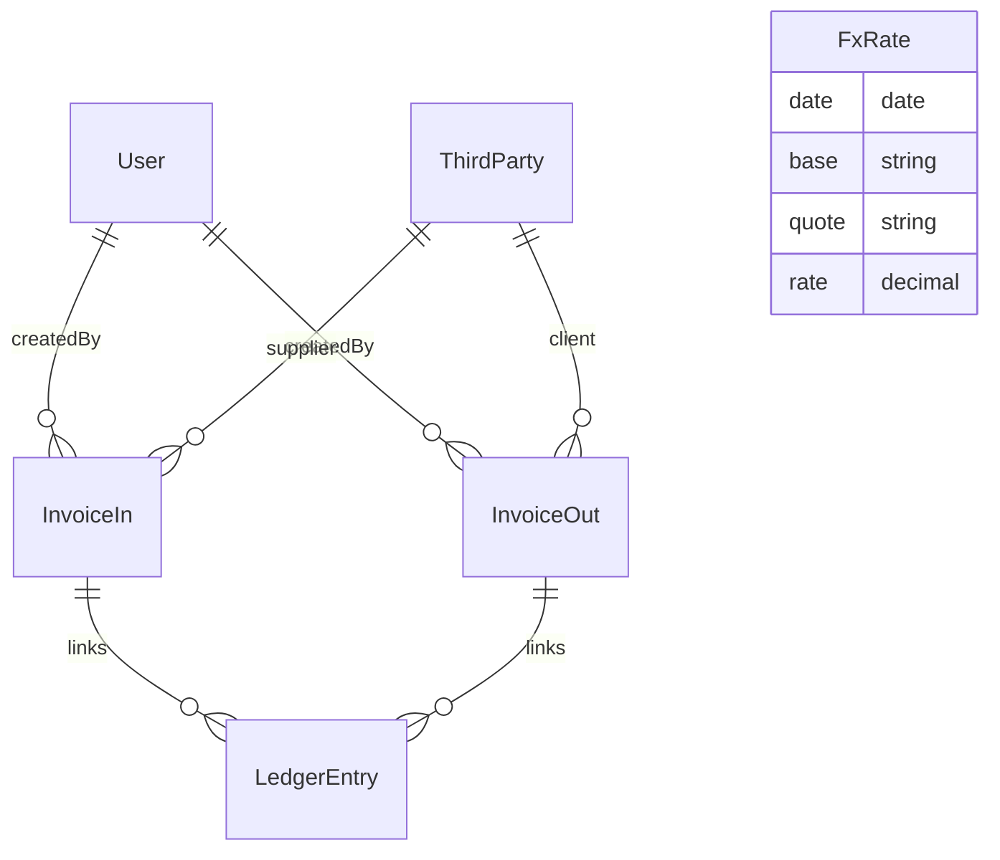

# Requisitos del sistema contable (MVP → escalable)

## 1. Alcance inicial

- Registro de ingresos y gastos para autónomo en España.
- Declaraciones trimestrales: Modelos 130, 303 y 349.
- Informe anual de apoyo a IRPF (visión agregada).
- En esta fase, finanzas personales solo en lo relacionado con la renta.

## 2. Facturas (entrada y salida)

- Subida de PDF/JPG/PNG y extracción de datos (OCR + LLM).
- Validación manual antes de guardar.
- Emisión de facturas desde plantilla (logo/serie/numeración) y export a PDF.

## 3. Multidivisa

- Soporte multidivisa (EUR, USD, PLN, BYN, …).
- Conversión automática a EUR con tipo oficial BCE en fecha de operación.

## 4. Impuestos y libros

- Cálculo asistido de 130/303/349 (estimaciones con reglas y redondeos).
- Exportación de Libros de Registro en CSV compatibles con AEAT.
- Resumen “Pre‑trimestre” y “Acumulado anual”.

## 5. OCR + LLM

- Pipeline: OCR (Tesseract/PaddleOCR) → LLM (API externa o LM Studio local) → JSON estructurado.
- MVP: API externa por rapidez; posterior: opción local (LM Studio).

## 6. Arquitectura técnica

- Full‑stack TypeScript: Next.js (web) + NestJS (api) + Prisma (PostgreSQL).
- Servicio OCR independiente (Node TS; endpoint `/parse`).
- Monorepo con pnpm workspaces; CI con lint+typecheck+tests.
- Docker Compose para autoalojado; posible migración a nube si el coste es razonable.
- Autenticación local (owner/viewer); cifrado en reposo/traslado a definir.

## 7. Testing (test‑first)

- Unit tests de reglas fiscales.
- Contratos API (OpenAPI/Swagger) + generación de tipos.
- E2E (Playwright) de flujos clave: cargar factura → validar → guardar → export libros.

## 8. Futuro (no‑MVP)

- Integración bancaria (import CSV o agregadores).
- MinIO/S3 para ficheros; colas (Redis) para OCR asíncrono.
- Roles adicionales, multiempresa, prorrata IVA, retenciones especiales.

## Tabla de entidades (resumen)

- ThirdParty: id, type, name, nif, euVatNumber, countryCode
- InvoiceIn: id, issueDate, supplierId→ThirdParty, base, vatRate, vatAmount, total, currency, fxToEUR, deductible, notes, euOperation, createdBy→User
- InvoiceOut: id, issueDate, series, number, clientId→ThirdParty, base, vatRate, vatAmount, total, currency, fxToEUR, notes, euOperation, createdBy→User
- LedgerEntry: id, date, type, amount, currency, fxToEUR, invoiceInId?, invoiceOutId?, notes
- FxRate: id, date, base:'EUR', quote:'USD'|'PLN'|'BYN'|..., rate

## Diagrama (pseudo‑ER)

---

Notas:
- Índices por fechas y (serie, número) en ventas.
- Multidivisa con conversión a EUR (tipo BCE por fecha de operación) y almacenamiento de `fxToEUR` en factura.
- Libros AEAT en CSV con mapeo por definir (placeholder en utilidades).
