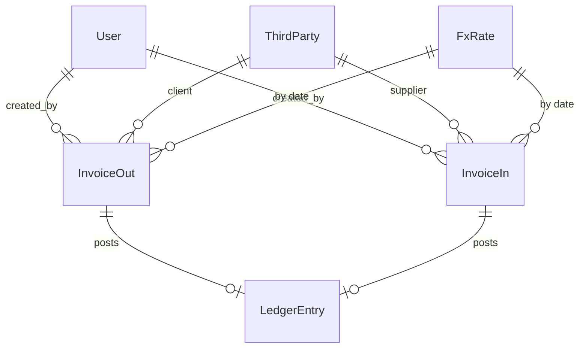

# Especificación técnica — Modelos trimestrales AEAT (130, 303, 349)

> **Ámbito**: autónomo en España. Periodicidad trimestral (130 y 303) y mensual/trimestral (349).  
> **Objetivo**: detallar datos mínimos, cálculos, validaciones y exportables que el sistema debe generar para cada modelo.

---

## 1) Periodicidad y plazos (resumen operativo)

| Modelo | Periodicidad por defecto | Plazo estándar de presentación |
|---|---|---|
| **130** | Trimestral | 1–20 de abril, julio y octubre; 1–30 de enero (4ºT) |
| **303** | Trimestral (o mensual si aplica) | 1–20 del mes siguiente (abril, julio, octubre); 1–30 enero (4ºT). Mensual: 1–30 del mes siguiente; enero: hasta último de febrero |
| **349** | Mensual, **trimestral si no superas 50.000 €** en el trimestre en curso y los cuatro anteriores | Mensual: 1–20 del mes siguiente (julio: hasta septiembre + 20 primeros días). Trimestral: 1–20 del mes siguiente; 4ºT: 1–30 de enero |

> Nota: en todos los casos, si el último día es inhábil, se traslada al primer día hábil siguiente.

---

## 2) Modelo 130 — IRPF (Pago fraccionado)

### Datos de entrada mínimos (periodo YTD)
- **Ingresos computables** acumulados desde el 1 de enero (`gross_income_ytd`).
- **Gastos deducibles** (incluye amortizaciones y provisiones) acumulados (`deductible_expenses_ytd`, `amortizations_ytd`, `provisions_ytd`).
- **Resultados negativos previos** del ejercicio (`prev_tr_negatives_ytd`).
- **Minoración por rendimientos netos** del ejercicio anterior (tramos hasta 12.000 €) (`minoracion_art110`).
- **Deducción por vivienda** (solo supuestos permitidos) (`housing_loan_deduction`).
- **Si es complementaria**: importe a ingresar previo (`prev_paid_amount`).

### Cálculos/Mapeo de casillas (mínimo viable)
- **01** = ingresos íntegros YTD.  
- **02** = gastos deducibles YTD (incluye amortizaciones y provisiones).  
- **03** = 01 − 02 (admite signo “−”).  
- **13** = minoración según tramos por rendimientos netos del ejercicio anterior (si ≤ 12.000 €).  
- **14** = resultado previo (según fórmula oficial).  
- **15** = resultados negativos de trimestres anteriores (si 14 > 0).  
- **16** = deducción vivienda (condiciones restrictivas).  
- **17** = total a ingresar/compensar.  
- **18** = importe de autoliquidación anterior (si **complementaria**).

### Reglas/validaciones clave
- Importes en **EUR** con 2 decimales; usar signo “−” solo en casillas permitidas.
- **Acumulación YTD**: todos los importes se acumulan desde el 1 de enero.
- Exención de presentar 130 para profesionales si en el año anterior **≥ 70 %** de ingresos estuvieron **sometidos a retención/ingreso a cuenta** (marcar en configuración del contribuyente).
- Complementaria **solo** para regularizar errores que dieron un resultado **inferior** al debido; otras rectificaciones → procedimiento de **rectificación** (no complementaria).

---

## 3) Modelo 303 — IVA (Autoliquidación)

### Datos de entrada mínimos (por periodo declarado)
**Devengado (repercutido):**
- Bases y cuotas por tipo: **0 %**, **4 %**, **10 %**, **21 %**.
- **Adquisiciones intracomunitarias** (AIB): base y cuota.
- **Inversión del sujeto pasivo**: base y cuota.
- **Modificaciones** (art. 80 LIVA): bases y cuotas con signo.

**Deducible (soportado):**
- Bases y cuotas **corrientes**.
- Bases y cuotas de **bienes de inversión**.
- **Prorrata** (general/especial) si procede.
- **Recargo de equivalencia** (si aplica).

### Mapeo de casillas (régimen general, mínimo)
- **IVA devengado**:  
  - 0 % → **150–152** (base/cuota).  
  - 4 % → **01–03**; **10 %** → **04–06**; **21 %** → **07–09**.  
  - AIB devengado → **10–11**.  
  - Inversión del sujeto pasivo → **12–13**.  
  - Modificaciones art. 80 → **14–15** (usar signo).  
  - Recargo equivalencia → **19–21**, **22–24**, **156–158**, **168–170** (según tipo).
- **IVA deducible**: **28 y siguientes** (corriente/bienes inversión, prorrata).  
- **Resultado (71)**: a ingresar / a compensar / devolución / cero / sin actividad (usar claves del propio 303).

### Reglas/validaciones clave
- Coherencia entre **sumas por tipo** y totales; signos en modificaciones.  
- Aplicar **prorrata** donde corresponda (no deducir cuotas asociadas a operaciones sin derecho).  
- En el último periodo, si **exonerado del 390**, cumplimentar el bloque adicional (actividades, prorrata, sectores, volumen anual).

---

## 4) Modelo 349 — Operaciones intracomunitarias (declaración informativa)

### Periodicidad
- **Mensual** con carácter general.  
- **Trimestral** si **no superas 50.000 €** de entregas + prestaciones intracomunitarias **en el trimestre de referencia y los cuatro trimestres anteriores**.  
- Si superas el umbral en el **2.º mes** del trimestre, presentar **mensual** incluyendo los **meses transcurridos** del trimestre (trimestre truncado).  
- **Anual** en supuestos tasados (p. ej., ≤ **35.000 €** global y ≤ **15.000 €** en entregas exentas; revisar condiciones vigentes).

### Campos por **línea 349**
- `period` (`1T…4T` o `01…12`), `country_code`, `partner_vat` (NIF-IVA UE), `name`, `clave`, `base_eur`, `rectificada` (bool), `base_rectificada_eur` (si aplica).

**Claves (mínimo):**
- **A** (adquisiciones bienes), **E** (entregas bienes), **T** (triangular), **S** (servicios prestados), **I** (servicios adquiridos), **M/H** (post‑importación exenta), **R/D/C** (consigna: transferencias/devoluciones/sustituciones).

### Reglas/validaciones clave
- **Moneda**: informar **en EUR** (si factura en otra divisa, convertir al **tipo BCE** del devengo).
- **Acumulación por operador y clave** dentro del periodo (agrupar líneas cuando proceda).
- Totales de cabecera: nº operadores, importes totales, nº con rectificación e importes rectificados; marcar **cambio de periodicidad** cuando corresponda.

---

## 5) Multidivisa (BCE)

- Guardar en cada factura/asiento el **tipo BCE** aplicado en la **fecha de operación/devengo** (`fx_to_eur`) y el **importe en EUR** resultante.  
- Trazabilidad: conservar `currency`, `amount_original`, `fx_source`, `fx_timestamp`.

---

## 6) Exportables y compatibilidad AEAT

- **Libros de Registro** (303) y trazas de 130 en **CSV/Excel** (para revisión y auditoría).  
- Preparar, si se decide, los **“Diseños de registro”** oficiales para automatizar ficheros normalizados de importación/presentación (130/303/349).  
- Mantener versión/ejericio en los exportables para reflejar cambios normativos.

---

## 7) Entidades y esquema (mínimo)

**Tablas**: `User`, `ThirdParty` (cliente/proveedor, NIF/NIF‑IVA, país), `InvoiceOut`, `InvoiceIn`, `LedgerEntry`, `FxRate`.

---

## 8) Checklist de pruebas (test‑first)

### 130
- [ ] Acumulación YTD correcta (01, 02, 03) con amortizaciones/provisiones.  
- [ ] Tramos de **minoración (13)** aplicados correctamente (≤ 12.000 €).  
- [ ] Uso de **negativos** solo en casillas permitidas.  
- [ ] **Complementaria** solo cuando el resultado previo fue inferior al debido; resto → rectificación.  
- [ ] Deducción **vivienda (16)** limitada a supuestos permitidos y a 660,14 €/trimestre cuando proceda.

### 303
- [ ] Sumas por **tipo** (4/10/21/0) coherentes (01–09, 150–152).  
- [ ] **AIB** devengado/deducible (10–11 y 28+).  
- [ ] **Inversión del sujeto pasivo** (12–13) y **modificaciones** (14–15) con signo correcto.  
- [ ] **Prorrata** aplicada a deducible (28+) y bloque extra si exonerado 390.  
- [ ] Resultado **(71)** y estado (ingresar/compensar/devolución/cero/sin actividad).  
- [ ] Recargo de equivalencia en casillas **19–21**, **22–24**, **156–158**, **168–170**.

### 349
- [ ] Cambio de **periodicidad** por superar **50.000 €** (mes 1 vs mes 2 del trimestre).  
- [ ] **Trimestre truncado**: incluir meses previos desde inicio de trimestre.  
- [ ] Conversión a **EUR** por tipo **BCE** del devengo.  
- [ ] Agrupación por **operador+clave** y totales de cabecera.  
- [ ] Rectificativas: marcar y sumar importes rectificados.

---

## 9) Notas de implementación
- Versionar reglas por **ejercicio** (las instrucciones se actualizan).  
- Añadir **banderas** por régimen especial (simplificado, RE, SII, etc.) aunque no formen parte del MVP.  
- Mantener **logs de cálculo** por casilla para auditabilidad (130/303) y por línea (349).

---

**Última actualización del documento:** 2025-08-24
